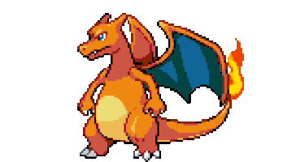
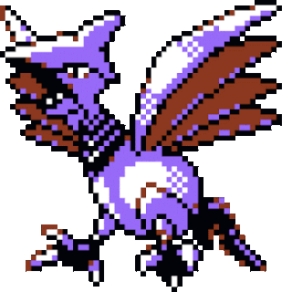
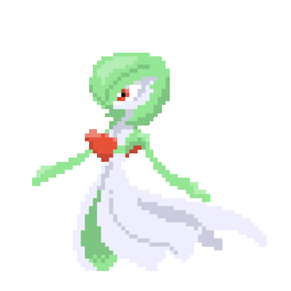
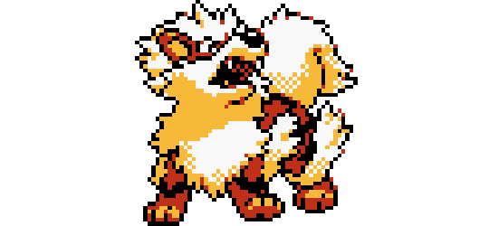
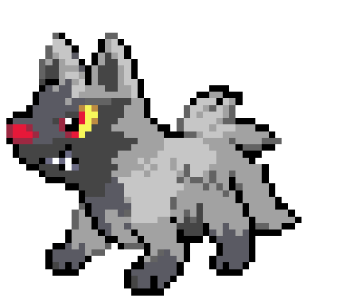
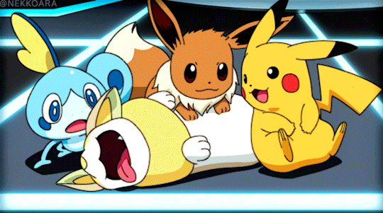

# 
POKEFIGHT

## ¿De que trata?
Pokefight es un videojuego de peleas desarrollado en C++, dónde tú serás el protagonista, deberás debilitar a los pokemones enemigos de una manera diferente de lo habitual... ¡Golpealos con pokebolas hasta que no puedan más! Una vez que los debilites lo suficiente, se rendirán y podrás pasar al siguiente nivel. Cada nivel contendrá a un jefe cada vez más poderoso, ten cuidado y no pierdas demasiadas vidas. ¡Mucha suerte!

###  Sección 1
-
    + Pikachu (Nvl 1)  
    
    

    + Charizard (Nvl 2)

    
    
    + Skarmory  (Nvl 3)
    

### Sección 2
  -
    + Gardevoir (Nvl 1)
    
    
    
    + Arcanine (Nvl 2)
    
     

     + Pochyena (Nvl 3)

     

## ¿Cómo se juega?
Al iniciar el juego, aparecerá las diferentes pantallas a las que podemos acceder presionando la tecla indicada. 

- ***Iniciar partida***: En esta pantalla saldremos al campo de batalla instantaneamente, pero te recomendamos que si es la primera vez que juegas, veas las pantallas adicionales 

- ***Ver objetos***: La pantalla *ver objetos* nos permitirá previsualizar los objetos disponibles en la batalla, si deseas avanzar con facilidad a través de los niveles, es muy importante que conozcas a estos pequeños aliados 

- ***Ver Pokemones***: Aquí conoceras a los enemigos con los que te enfrentarás para que puedas desarrollar una estrategia previa al combate. Todo lo que debas saber acerca de ellos podrás encontrarlo en esta pantalla. 

- ***Salir***: ¡Hasta pronto!

---

 ¡ DISFRUTA EL JUEGO!